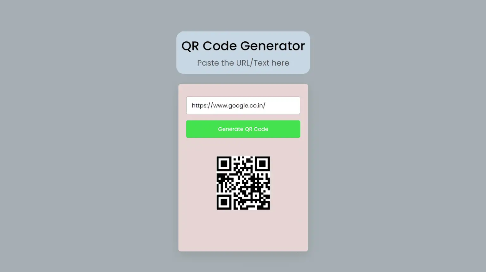

# 🔳 QR Code Generator

A simple web app to generate QR codes from any text or URL. Built using **HTML**, **CSS**, and **JavaScript**.



---

## 🚀 Live Demo

👉 [Click here to view](https://your-username.github.io/qr-code-generator)

> Replace `your-username` with your GitHub username once deployed.

---

## 🧠 Features

- 🔹 Generate QR codes for text or links
- 🔹 Responsive design for all screen sizes
- 🔹 Instant QR rendering using public API
- 🔹 No dependencies – works with vanilla JS

---

## 📁 Folder Structure

```
qr-code-generator/
├── Index.html       # Main HTML layout
├── Style.css        # Styling for UI
└── Script.js        # Logic for generating QR
```

---

## 🔧 How to Use (Locally)

1. Clone the repo:
   ```bash
   git clone https://github.com/your-username/qr-code-generator.git
   cd qr-code-generator
   ```

2. Open `Index.html` in your browser:
   ```bash
   start Index.html      # Windows
   open Index.html       # macOS
   xdg-open Index.html   # Linux
   ```

---

## 🌐 API Used

- [GoQR API](https://goqr.me/api/) – Simple URL-based QR code generation.

---

## 📦 Deploy on GitHub Pages

1. Push your code to a public GitHub repo:
   ```bash
   git init
   git add .
   git commit -m "Initial commit"
   git branch -M main
   git remote add origin https://github.com/your-username/qr-code-generator.git
   git push -u origin main
   ```

2. Go to your repo → **Settings** → **Pages**

3. Under "Source", select `main` branch and root (`/`)

4. Your site will be live at:
   ```
   https://your-username.github.io/qr-code-generator
   ```

---

## 👤 Author

**Pallerla Sohan**  
Feel free to connect on GitHub or add a portfolio link.

---

## 📄 License

This project is open-source and free to use.
